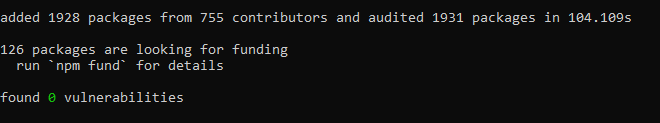
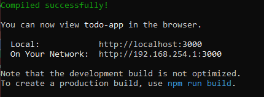

# IETI Laboratorio 1

Daniel Felipe Walteros Trujillo

# Uso

1.  Clonar el repositorio.
2.  Usar el comando `npm install` para instalar las dependencias, al final se verá un resultado así.

  

3.  Usar el comando `npm start` para ejecutar la aplicación, por defecto se abrirá en la dirección `http://localhost:3000/` y verás lo siguiente en la consola.

  

# Código de Honor
------
Debes seguir el Código de honor del ingeniero de sistemas para defender el estándar de integridad académica de la ECI:

- Tus respuestas a tareas, cuestionarios y exámenes deben ser tu propio trabajo (excepto para las tareas que permiten explícitamente la colaboración).

- No puedes compartir tus soluciones de tareas, cuestionarios o exámenes con otra persona a menos que el instructor lo permita explícitamente. Esto incluye cualquier cosa escrita por ti, como también cualquier solución oficial proporcionada por el docente o el monitor del curso.

- No puedes participar en otras actividades que mejorarán de manera deshonesta tus resultados o que mejorarán de manera deshonesta o dañarán los resultados de otras personas.
