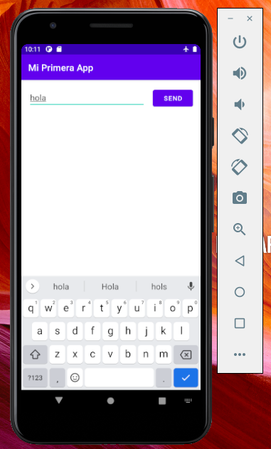
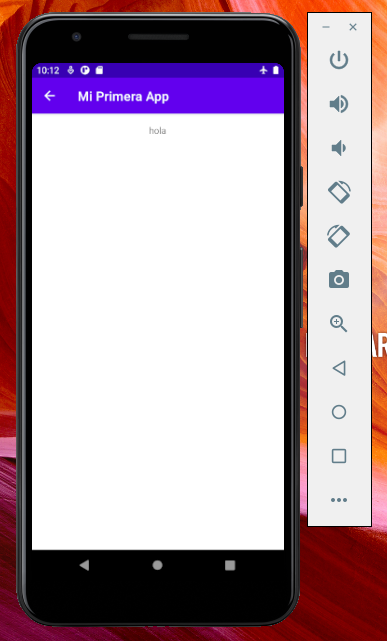

# IETI Laboratorio 11

Daniel Felipe Walteros Trujillo

## Prerequisitos

- Java Version 8 o superior.
- Gradle Versión 5 o superior.
- Android Studio

## Uso

1. Clonar el repositorio.

2. Abrir el proyecto con Android Studio.

3. Ejecutar desde Android Studio el proyecto, si no sabes como ejecutarlo leer la información en este [Link](https://developer.android.com/training/basics/firstapp/running-app)

4. Deberias ver una pantalla similar a lo siguiente:

   
   
   Al escribir algo en el cuadro de texto y presionar el botón para enviar verás algo similar a lo siguiente:
   
   

# Código de Honor
------
Debes seguir el Código de honor del ingeniero de sistemas para defender el estándar de integridad académica de la ECI:

- Tus respuestas a tareas, cuestionarios y exámenes deben ser tu propio trabajo (excepto para las tareas que permiten explícitamente la colaboración).

- No puedes compartir tus soluciones de tareas, cuestionarios o exámenes con otra persona a menos que el instructor lo permita explícitamente. Esto incluye cualquier cosa escrita por ti, como también cualquier solución oficial proporcionada por el docente o el monitor del curso.

- No puedes participar en otras actividades que mejorarán de manera deshonesta tus resultados o que mejorarán de manera deshonesta o dañarán los resultados de otras personas.

[Link de la Guia del Laboratorio](https://developer.android.com/training/basics/firstapp)
